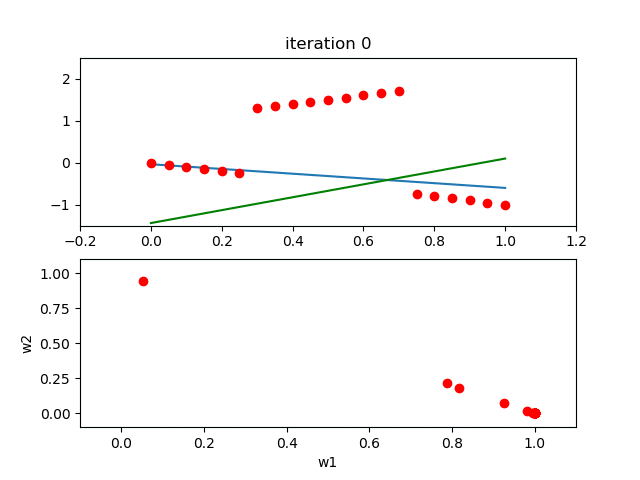

# expectation-maximization on 2 lines
 fitting data to 2 lines using expectation maxmization and weighted least squares.
 Here we assumne that the data is generated from 2 lines and we use expectation maximization to iteratively find these 2 lines.
 the algorithm comprises of 2 steps:
 1. expectation step:
 in this step we find the weights assossiated with each point. each point will have two weights, w1 and w2.
 w1 is a probablity that is an estimate of this point belonging to line 1.
 w2 is a probablity that is an estimate of this point belonging to line 2.
 
 in the expectation step, we assume that the line parameters are known.
 
 the weights are calculated using residuals: the difference between the predicted y using our current line parameters and thea actual y from the data.
 
2. maximization step:
in this step we use the weights found in the previous step and using weighted least squares to calculate the best two fitting lines.

the most important part in EM is initialization. if you don't have a good first initialization then it will either not converge or converge to a local min.

10 iteration example:
 
 
